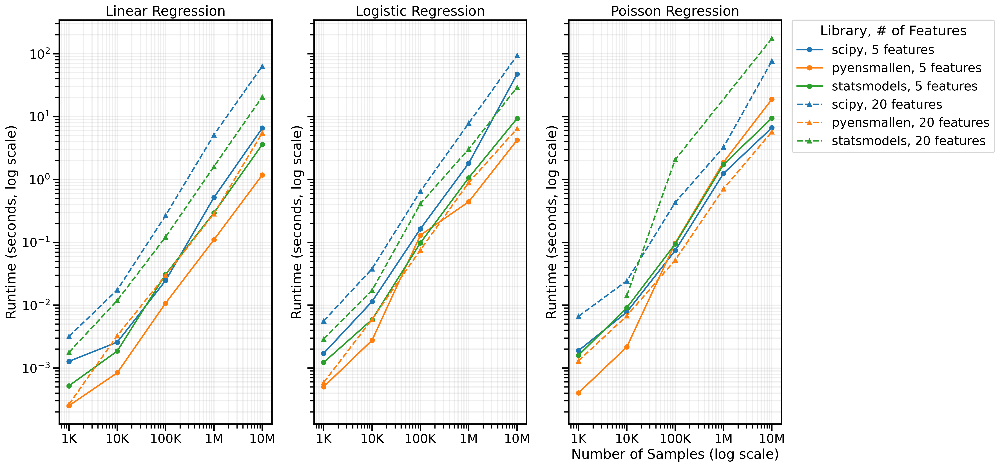

# `pyensmallen`: python bindings for the [`ensmallen`](https://ensmallen.org/) library for numerical optimization

Minimal python bindings for `ensmallen` library. Currently supports
+ L-BFGS, with intended use for optimisation of smooth objectives for m-estimation
+ ADAM (and variants with different step-size routines) - makes use of ensmallen's templatization.
+ Frank-Wolfe, with intended use for constrained optimization of smooth losses
  - constraints are either lp-ball (lasso, ridge, elastic-net) or simplex

See [ensmallen docs](https://ensmallen.org/docs.html) for details. The `notebooks/` directory walks through several statistical examples.

## speed
`pyensmallen` is very fast. A comprehensive set of benchmarks is available in the `benchmarks` directory. The benchmarks are run on an intel 12th gen framework laptop. Benchmarks vary data size (sample size and number of covariates) and parametric family (linear, logistic, poisson) and compare `pyensmallen` with `scipy` and `statsmodels` (I initially also tried to keep `cvxpy` in the comparison set but it was far too slow to be in the running). At large data sizes, pyensmallen is roughly an order of magnitude faster than scipy, which in turn is an order of magnitude faster than statsmodels. So, a single statsmodels run takes around as long as a pyensmallen run that naively uses the nonparametric bootstrap for inference. This makes the bootstrap a viable option for inference in large data settings.



## Installation:

__from pypi__

```
pip install pyensmallen
```

__from source__
1. Install `armadillo` and `ensmallen` for your system (build from source, or via conda-forge; I went with the latter)
2. git clone this repository
3. `pip install -e .`
4. Profit? Or at least minimize loss?

__from wheel__
- download the appropriate `.whl` for your system from the more recent release listed in `Releases` and run `pip install ./pyensmallen...` OR
- copy the download url and run `pip install https://github.com/apoorvalal/pyensmallen/releases/download/<version>/pyensmallen-<version>-<pyversion>-linux_x86_64.whl`
