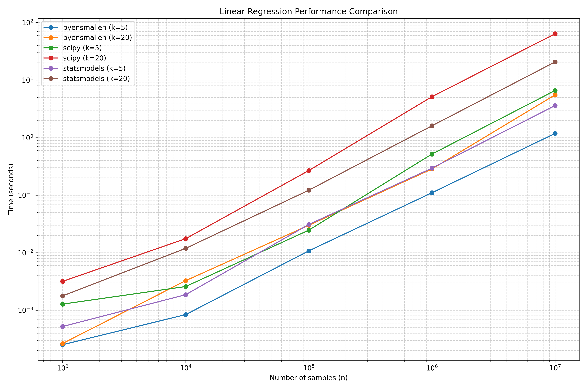
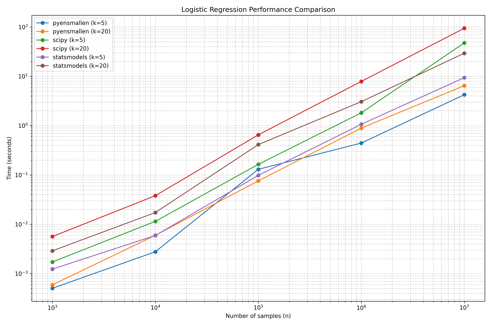

This document summarizes comprehensive performance benchmarking of
pyensmallen against other popular optimization libraries across
various regression models and dataset sizes.

## Performance Analysis

### Overall Performance

- pyensmallen consistently outperforms both SciPy and statsmodels
  across all regression models and data sizes
- The performance advantage becomes more dramatic as dataset size
  increases
- pyensmallen shows particularly strong performance with
  high-dimensional data (k=20)

### Model-Specific Performance

#### Linear Regression
- pyensmallen is 5-11× faster than SciPy for large datasets (n=10M)
- pyensmallen is 3-4× faster than statsmodels for large datasets
- The speed advantage increases with both dataset size and
  dimensionality

#### Logistic Regression
- pyensmallen achieves 11-15× speedup over SciPy for large datasets
- pyensmallen is 2-4.5× faster than statsmodels
- Extremely efficient with high-dimensional data

#### Poisson Regression
- pyensmallen is 13× faster than SciPy for high-dimensional large
  datasets
- pyensmallen is 30× faster than statsmodels in these cases
- statsmodels sometimes fails to converge on large Poisson problems

### Scaling Properties
- All libraries show roughly linear scaling with data size (on the
  log-log plots)
- pyensmallen maintains its performance advantage across the entire
  range of data sizes
- The gap between pyensmallen and other libraries widens as data size
  increases

### Accuracy
- All libraries achieve essentially identical parameter accuracy (MSE
  values match closely)
- This confirms that pyensmallen's speed advantage doesn't come at the
  cost of accuracy
- For linear regression, the MSE values decrease predictably as sample
  size increases

### Dimensionality Effects
- Higher dimensionality (k=20 vs k=5) impacts all libraries, but
  pyensmallen handles it much better
- SciPy shows the steepest performance degradation with increased
  dimensions
- pyensmallen's relative advantage is greater for high-dimensional
  problems

## Key Takeaways

1. **Best-in-Class Performance**: pyensmallen consistently delivers
   the fastest optimization across all regression types, especially at
   scale.

2. **Excellent Scaling**: pyensmallen scales much better than
   competitors with both dataset size and dimensionality.

3. **Perfect for Large Datasets**: The performance advantage is most
   pronounced for datasets with millions of observations, making
   pyensmallen particularly valuable for big data applications.

4. **No Accuracy Tradeoff**: The speed gains don't compromise solution
   quality - all libraries converge to essentially the same
   parameters.

5. **Reliability**: Unlike statsmodels that occasionally fails to
   converge on Poisson problems, pyensmallen shows robust convergence
   across all test cases.

6. **High-Dimensional Strength**: pyensmallen's superior handling of
   high-dimensional data makes it especially suitable for complex
   modeling tasks.

## Visualization

### Detailed Time Comparisons

## Methodology

Benchmarks were conducted using the `benchmark_performance.py` script,
which tests each library on synthetic datasets of varying sizes
(n=1,000 to n=10,000,000) and dimensions (k=5 and k=20). Each
optimization algorithm was run on identical data and parameter
initialization to ensure a fair comparison.

For each model type (linear, logistic, and Poisson regression), we
measured:
1. Execution time
2. Parameter accuracy (MSE compared to true parameters)
3. Convergence reliability

The benchmark script is designed to be reproducible, with all random
seeds fixed for consistent data generation across test runs.
