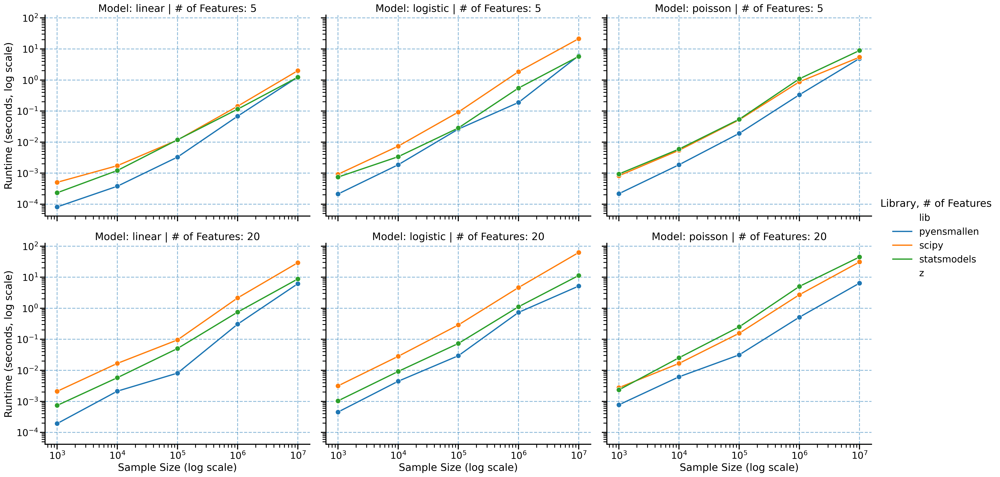
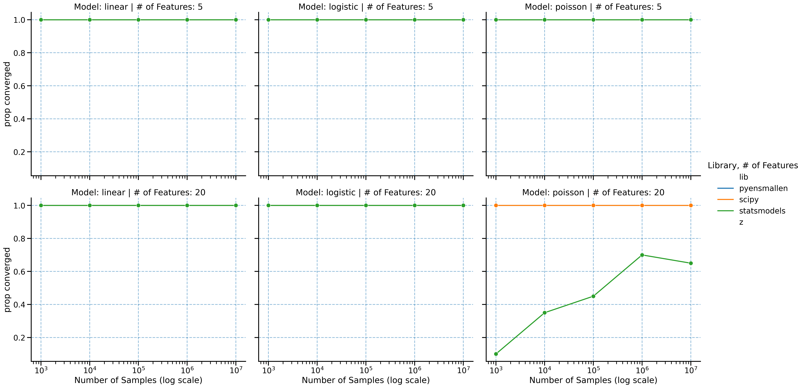

```{python}
#| echo: false
import pandas as pd

summary = pd.read_csv("../paper/benchmark_summary.csv")

wide = summary.pivot_table(
    index=["Model", "n_samples", "n_features"],
    columns="Library",
    values="Avg Time (s)",
).reset_index()

for lhs, rhs in [("scipy", "pyensmallen"), ("statsmodels", "pyensmallen")]:
    if lhs in wide.columns and rhs in wide.columns:
        wide[f"{lhs}_speedup"] = wide[lhs] / wide[rhs]

speedup_cols = [
    col
    for col in ["Model", "n_samples", "n_features", "scipy_speedup", "statsmodels_speedup"]
    if col in wide.columns
]

speedups = wide[speedup_cols].copy()
for col in ["scipy_speedup", "statsmodels_speedup"]:
    if col in speedups.columns:
        speedups[col] = speedups[col].round(2)

representative = speedups.loc[
    (speedups["n_samples"] == 10_000_000) & (speedups["n_features"] == 20)
].copy()

if not representative.empty:
    representative["n_samples"] = representative["n_samples"].map(lambda x: f"{int(x):,}")
    representative = representative.rename(
        columns={
            "n_samples": "Samples",
            "n_features": "Features",
            "scipy_speedup": "vs SciPy",
            "statsmodels_speedup": "vs statsmodels",
        }
    )

fastest = (
    summary.loc[summary["Is Fastest"].fillna(False), ["Model", "n_samples", "n_features", "Library"]]
    .sort_values(["Model", "n_samples", "n_features"])
    .reset_index(drop=True)
)
```

`pyensmallen` is built for the regime where mainstream Python estimation stacks start to drag: large samples, repeated model fits, and inference workflows that require resampling or repeated solves.

Across linear, logistic, and Poisson regression, the basic pattern is consistent: as the problem gets larger, `pyensmallen` tends to pull away from SciPy and statsmodels rather than merely keeping pace.

## Headline results

At 10 million observations and 20 features:

```{python}
#| echo: false
representative
```

That is the practical story. The time saved on point estimation can be spent on bootstrap inference, specification search, cross-validation, and sensitivity analysis.

## Runtime scaling



Benchmarks span sample sizes from 1,000 to 10,000,000 observations and both low- and moderate-dimensional settings. The slope separation matters more than any single point estimate: the larger the problem, the larger the payoff from using a faster optimizer stack.

## Convergence behavior



Speed only matters if the optimizer still lands on the same solution. The convergence comparisons show that the runtime gains are not coming from a loose stopping rule or low-quality fit.

## Full benchmark grid

The full grid below reports multiplicative speedups relative to SciPy and statsmodels across all benchmark configurations.

```{python}
#| echo: false
speedups
```

## Fastest method by configuration

```{python}
#| echo: false
fastest
```

## Why this matters

- Linear regression is especially notable because `statsmodels` uses a closed-form estimator, yet `pyensmallen` remains highly competitive and often faster at scale.
- Logistic regression shows the cleanest large-sample advantage relative to SciPy and statsmodels.
- Poisson regression has the most uneven competitor behavior, which makes `pyensmallen`'s combination of speed and stable optimization especially useful.
- In practical terms, these runtimes make bootstrap-based inference much more realistic on large datasets.
