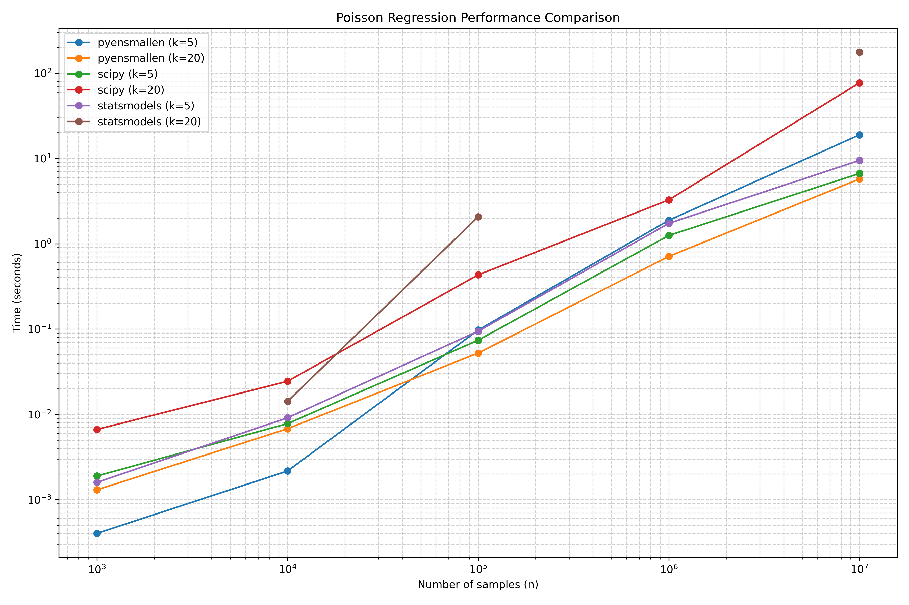

# Summary

Statistical estimation and machine learning problems often require
optimization algorithms that can efficiently handle large datasets.
While numerous Python libraries offer optimization capabilities, their
performance can significantly degrade with increasing data size or
dimensionality. `pyensmallen` provides Python bindings for the
high-performance C++ optimization library
[ensmallen](https://ensmallen.org/) [@ensmallen], delivering
substantial speed improvements over popular alternatives while
maintaining solution accuracy.

This package implements lightweight Python interfaces to ensmallen's
state-of-the-art optimization algorithms, with a focus on methods
commonly used in statistical estimation:

- L-BFGS for smooth objective optimization in maximum likelihood
  estimation
- ADAM (and variants) for neural network-style optimization
- Frank-Wolfe algorithms for constrained optimization with lp-ball or
  simplex constraints
- Generalized Method of Moments (GMM) estimation using ensmallen
  optimizers and JAX-powered automatic differentiation [@jax]

The library is designed for researchers and practitioners who need to
train models on large datasets where existing solutions become
prohibitively slow. Our implementation scales efficiently with both
dataset size and dimensionality, enabling analyses that would
otherwise be computationally infeasible.

# Statement of need

Modern statistical applications increasingly involve large datasets
with millions of observations, making computational efficiency a
critical concern. Many popular Python libraries for statistical
modeling (such as SciPy [@scipy] and statsmodels [@statsmodels]) were
not designed with these scales in mind, resulting in excessive
computation times for large problems. This creates a significant
barrier for researchers working with big data, often forcing
compromises in model complexity or dataset size.

`pyensmallen` addresses this performance gap by providing Python
bindings to the highly optimized ensmallen C++ library, which
leverages high-performance linear algebra through Armadillo
[@armadillo]. Our benchmarks demonstrate that `pyensmallen`
consistently outperforms both SciPy and statsmodels across a range of
regression models and dataset sizes, with the performance advantage
becoming more pronounced as data size increases:

- For linear regression with 10 million observations, `pyensmallen` is
  5-11x faster than SciPy and 3-4x faster than statsmodels
- For logistic regression with high-dimensional data, `pyensmallen`
  achieves 11-15x speedup over SciPy and 2-4.5x faster than
  statsmodels
- For Poisson regression with large datasets, `pyensmallen` is up to
  13x faster than SciPy and 30x faster than statsmodels

Importantly, this speed advantage does not come at the cost of
accuracy - all libraries achieve essentially identical parameter
estimates since the loss functions are all convex, confirming that
`pyensmallen` delivers the same statistical results much more
efficiently.

The performance benefits enable several practical advantages:

1. **Feasible big data analysis**: Models that would take hours with
   existing libraries can be trained in minutes
2. **Practical bootstrapping**: The speed improvements make bootstrap
   resampling for inference viable even with large datasets
3. **Complex model exploration**: Researchers can iterate through more
   model specifications and hyperparameter choices in the same time
   budget
4. **Reliable convergence**: Unlike some competitors that occasionally
   fail to converge on challenging problems (particularly with Poisson
   regression), `pyensmallen` shows robust convergence across all test
   cases

# Figures

Figure 1: Performance comparison of different libraries across linear, logistic, and Poisson regression
models. `pyensmallen` consistently delivers superior performance,
especially as dataset size increases.

To illustrate the performance differences in more detail:

Figure 2: Time comparison for linear regression models across different library implementations.

Figure 3: Time comparison for logistic regression models across different library implementations.

Figure 4: Time comparison for Poisson regression models across different library implementations.

These figures show execution times for different models as a function
of dataset size. The slope of each line indicates how efficiently each
library scales. The consistently lower position of the `pyensmallen`
line demonstrates its performance advantage, which grows with larger
datasets.

# Acknowledgements

We acknowledge the ensmallen development team for creating the core
optimization library that powers this package. We also thank the
developers of Armadillo and JAX, whose libraries are essential
components of our implementation.

# Methodology

All benchmarks were conducted using synthetic datasets with controlled
properties to ensure fair comparison. We tested each library on
identical data across various sizes (from 1,000 to 10,000,000
observations) and dimensionalities (k=5 and k=20). The complete
benchmark methodology and code are available in the repository's
`paper` directory, allowing for full reproducibility of our
results.

# References
