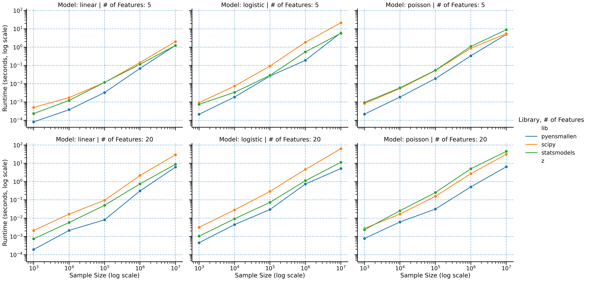

# Summary

Modern statistical applications increasingly involve large datasets
with millions of observations, making computational efficiency a
critical concern. Many popular Python libraries for statistical
modeling (such as SciPy [@scipy] and statsmodels [@statsmodels]) were
not designed with these scales in mind, resulting in excessive
computation times for large problems. This also limits users' ability to
perform uncertainty quantification via the nonparametric bootstrap.
This creates a significant barrier for researchers working with big data, often forcing
compromises in model complexity or dataset size.

`pyensmallen` seeks to solve this problem by providing Python
bindings to the highly optimized header-only [ensmallen](https://ensmallen.org/) [@ensmallen] C++ library, which
leverages high-performance linear algebra through Armadillo
[@armadillo].  This enables access to ensmallen's
state-of-the-art optimization algorithms, with a focus on methods
commonly used in statistical estimation:

- L-BFGS for smooth objective optimization in maximum likelihood
  estimation
- ADAM (and variants) for neural network-style optimization SGD (optionally
  with momentum)
- Frank-Wolfe algorithms for constrained optimization with lp-ball or
  simplex constraints
- Generalized Method of Moments (GMM) estimation using ensmallen
  optimizers and JAX-powered automatic differentiation [@jax]

The library is designed for researchers and practitioners who need to
train models on large datasets where existing solutions become
prohibitively slow. Our implementation scales efficiently with both
dataset size and dimensionality, enabling analyses that would
otherwise be computationally infeasible.  Our benchmarks demonstrate that `pyensmallen`
consistently outperforms both SciPy and statsmodels across a range of
regression models and dataset sizes, with the performance advantage
becoming more pronounced as data size increases:

- For linear regression with 10 million observations, `pyensmallen` is
  5-11x faster than SciPy and 3-4x faster than statsmodels
- For logistic regression with high-dimensional data, `pyensmallen`
  achieves 11-15x speedup over SciPy and 2-4.5x faster than
  statsmodels
- For Poisson regression with large datasets, `pyensmallen` is up to
  13x faster than SciPy and 30x faster than statsmodels

Importantly, this speed advantage does not come at the cost of
accuracy - all libraries achieve essentially identical parameter
estimates since the loss functions are all convex, confirming that
`pyensmallen` delivers the same statistical results much more
efficiently.

The performance benefits enable several practical advantages:

- **Practical nonparametric-bootstrap**: The speed improvements make bootstrap
   resampling for inference viable even with large datasets. This allows users to construct confidence intervals around most statistical functionals
- **Model Selection Benefits**: Researchers can iterate through more
   model specifications and hyperparameter choices in the same time
   budget
- **Reliable convergence**: Unlike some competitors that occasionally
   fail to converge on challenging problems (particularly with Poisson
   regression), `pyensmallen` shows robust convergence across all test
   cases

# Benchmarks

## Runtime

All benchmarks were conducted using synthetic datasets with controlled
properties to ensure fair comparison. We tested each library on
identical data across various sizes (from 1,000 to 10,000,000
observations) and dimensionalities (k=5 and k=20) over twenty iterations and measure mean runtime and RMSE. The complete
benchmark methodology and code are available in the repository's
`paper` directory, allowing for full reproducibility of our
results.

Figure 1: Performance comparison of different libraries across linear, logistic, and Poisson regression
models. `pyensmallen` consistently delivers superior performance,
especially as dataset size increases. This is especially surprising for linear regression, where statsmodels uses the closed form solution $\hat{\beta} = (X'X)^{-1}X'y$, while `pyensmallen` and scipy minimize square loss using L-BFGS.
These figures show execution times for different models as a function
of dataset size. The slope of each line indicates how efficiently each
library scales. The consistently lower position of the `pyensmallen`
line demonstrates its performance advantage, which grows with larger
datasets.

# References
